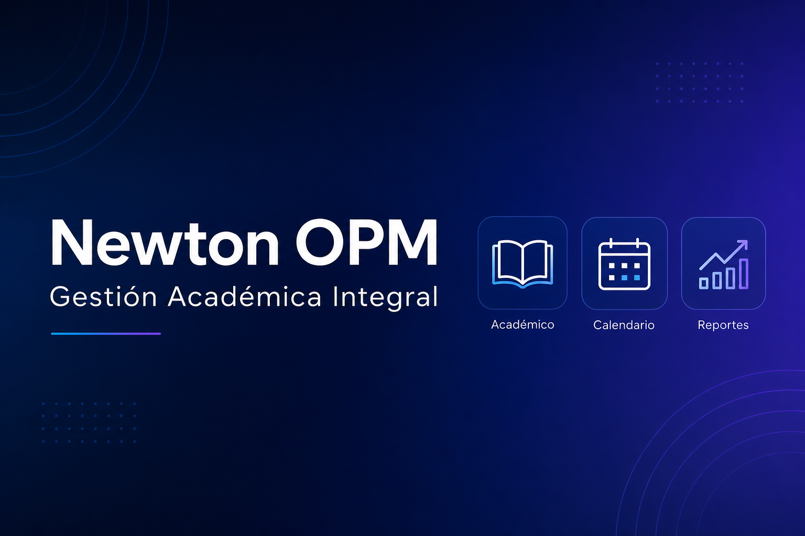

# Newton OPM

**Plugin de WordPress** para gestión académica integral en instituciones educativas. Desarrollado por [David Villar](https://github.com/DavidVillarM) para Newton Centro de Estudios.

> OPM — *Oficina de Planificación y Monitoreo*: plataforma unificada para conducta, asistencia y exámenes.

---

## Resumen para portafolio

Sistema web completo embebido en WordPress que reemplaza procesos manuales con una **SPA (Single Page Application)** conectada a una **API REST** propia. Incluye control de acceso por roles, migraciones automáticas de base de datos, importación de archivos (PDF, Excel, Word) y generación de reportes en CSV/PDF.

**Stack tecnológico:** PHP 7.4+ · WordPress REST API · JavaScript (vanilla) · MySQL · Composer · PHPSpreadsheet · TCPDF · PDF Parser

---

## Módulos principales

| Módulo | Funcionalidad |
|--------|---------------|
| **Conducta** | Evaluación individual y grupal de alumnos; facultades, carreras, cursos y grupos |
| **Asistencia** | Materias, sesiones de clase, docentes asignados y registro de presentes |
| **Exámenes** | Carga masiva e importación desde PDF y hojas de cálculo |
| **Reportes** | Exportación CSV y PDF de rendimiento por alumno, aula y curso |
| **Roles** | Permisos diferenciados: administrador, docente y funcionario de oficina |

---

## Destacados técnicos

- **+5.000 líneas** de API REST en PHP con endpoints CRUD completos
- **Migraciones de esquema** versionadas que se aplican sin reactivar el plugin
- **Estado de sesión** en el frontend (`sessionStorage`) para restaurar navegación y modales
- **Anti-caché** en respuestas REST para entornos con CDN (Hostinger, LiteSpeed, Cloudflare)
- **Importación inteligente** de exámenes con parsing de PDF y hojas de cálculo

---

## Requisitos

- WordPress 5.8+
- PHP 7.4 o superior
- [Composer](https://getcomposer.org/)
- MySQL / MariaDB

---

## Instalación

```bash
git clone https://github.com/DavidVillarM/newton-opm.git wp-content/plugins/newton-opm
cd wp-content/plugins/newton-opm
composer install --no-dev
```

1. Activa el plugin en **Plugins → Plugins instalados**.
2. Crea una página con slug `opm` e inserta el shortcode:

   ```
   [newton_opm_app]
   ```

3. Asigna los roles de WordPress a los usuarios autorizados.

> El shortcode `[newton_conducta_app]` y la página con slug `conducta` siguen funcionando por compatibilidad.

---

## Estructura del proyecto

```
newton-opm/
├── newton-opm.php           # Punto de entrada del plugin
├── includes/                # Backend PHP (REST, DB, roles, importación)
├── assets/dist/             # Frontend SPA (JS + CSS)
├── composer.json
└── vendor/                  # Dependencias (no versionadas; instalar con Composer)
```

---

## API REST

Base URL: `/wp-json/conducta/v1/`

| Área | Rutas de ejemplo |
|------|------------------|
| Conducta | `/facultades`, `/carreras`, `/alumnos`, `/evaluaciones` |
| Asistencia | `/asistencia/materias`, `/asistencia/sesiones` |
| Exámenes | `/examenes/...` |

---

## Autor

**David Villar** — Estudiante de Ingeniería en Informática

- GitHub: [@DavidVillarM](https://github.com/DavidVillarM)
- LinkedIn: [in/davidvillarm](https://www.linkedin.com/in/davidvillarm)

---

## Texto sugerido para LinkedIn

Puedes copiar y adaptar esto en la sección **Proyectos** de tu perfil:

> **Newton OPM** — Plugin WordPress para gestión académica integral (conducta, asistencia y exámenes). Desarrollé una SPA en JavaScript conectada a una API REST en PHP con control de roles, migraciones de BD, importación de PDF/Excel y generación de reportes. Stack: PHP, WordPress, JavaScript, MySQL, Composer.
>
> Repositorio: github.com/DavidVillarM/newton-opm

---

## Licencia

Software propietario. Todos los derechos reservados.
